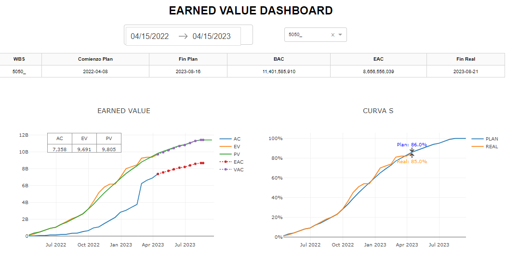

## EARNED VALUE DASHBOARD WITH FORECASTING OF PROYECTS.



This project has been developed for obtain a degree in Master of science of Project Management. From here it is possible to improve the code for get a better forecasting of the project goals, the earned value aproximation have the possibility of been apply in any field and is a strong tool for management.

## Instalation process

Configure your enviroment with:

```
PYTHON_VERSION == 3.10.11
python3 -m venv envforrender && source envforrender/bin/activate && pip install --upgrade pip && pip install -r requirements.txt
source envforrender/bin/activate && gunicorn models.plot:server
```

## content

data directory: it contains the datasets of the project

models directory: it contains

## Render app

This app its been running in render with this url:

https://earnaedvalue.onrender.com/

and with this confiration:

```
PYTHON_VERSION == 3.10.11
python3 -m venv envforrender && source envforrender/bin/activate && pip install --upgrade pip && pip install -r requirements.txt
source envforrender/bin/activate && gunicorn models.plot:server
```

